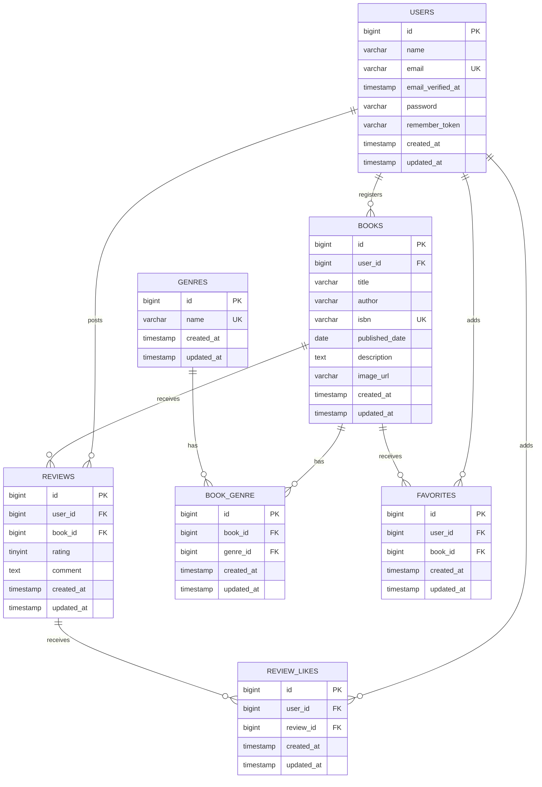

# BookShelf 書籍レビューアプリ

BookShelfは、書籍の登録・閲覧、レビュー投稿、お気に入り登録、レビューへのいいねなどを管理するLaravel製の書籍レビューアプリです。

Webブラウザ向けの画面はBladeとセッション認証で提供し、外部アプリケーション向けには書籍情報を操作できるREST APIを提供します。

## 主な機能

- ユーザー登録・ログイン・ログアウト
- 書籍の一覧・詳細表示・登録・編集・削除
- ジャンルの一覧・詳細表示・登録・編集・削除
- レビューの投稿・編集・削除
- 書籍のお気に入り登録・解除・一覧表示
- レビューへのいいね・解除
- 平均評価・レビュー件数に基づく上位10冊のランキング
- 検索・ジャンル絞り込み・ページネーションに対応した公開REST API
- 所有者または投稿者に基づく更新・削除の認可

## 使用技術

- PHP 8.5
- Laravel 10.50.2
- MySQL 8.4
- Laravel Sail
- Laravel Fortify
- Vite 5
- Tailwind CSS 3
- Alpine.js
- PHPUnit 10
- Laravel Pint

## 開発環境URL

| サービス | URL |
|---|---|
| BookShelf | http://localhost |
| phpMyAdmin | http://localhost:8080 |

## 環境構築

### 前提環境

- Git
- Docker DesktopまたはDocker Engine
- Docker Compose

### 1. リポジトリを取得

```bash
git clone https://github.com/07tasuku06-cloud/bookshelf-app.git
cd bookshelf-app
```

### 2. PHP依存パッケージをインストール

ホスト環境にComposerがない場合は、Dockerを使用してインストールします。

```bash
docker run --rm \
  -u "$(id -u):$(id -g)" \
  -v "$(pwd):/var/www/html" \
  -w /var/www/html \
  -e COMPOSER_CACHE_DIR=/tmp/composer_cache \
  laravelsail/php82-composer:latest \
  composer install
```

### 3. 環境変数を設定

```bash
cp .env.example .env
```

`.env`のデータベース設定が次の内容になっていることを確認します。

```env
DB_CONNECTION=mysql
DB_HOST=mysql
DB_PORT=3306
DB_DATABASE=laravel
DB_USERNAME=sail
DB_PASSWORD=password
```

`DB_HOST`には`localhost`ではなく、Docker Composeのサービス名である`mysql`を指定します。

### 4. Sailを起動

```bash
./vendor/bin/sail up -d
```

### 5. アプリケーションキーを生成

```bash
./vendor/bin/sail artisan key:generate
```

### 6. フロントエンド依存パッケージをインストール

```bash
./vendor/bin/sail npm install
```

### 7. データベースを構築して初期データを投入

```bash
./vendor/bin/sail artisan migrate:fresh --seed
```

`migrate:fresh`は既存のテーブルとデータを削除してから再構築します。既存データを残す必要がある環境では、代わりに次を実行してください。

```bash
./vendor/bin/sail artisan migrate --seed
```

### 8. Vite開発サーバーを起動

```bash
./vendor/bin/sail npm run dev
```

ブラウザで http://localhost を開きます。

開発を終了するときは、Viteを`Ctrl+C`で停止し、次のコマンドでコンテナを停止します。

```bash
./vendor/bin/sail down
```

## 初期データ

| テーブル | 件数 |
|---|---:|
| users | 5 |
| genres | 10 |
| books | 11 |
| reviews | 32 |
| book_genre | 16 |
| favorites | 19 |
| review_likes | 48 |

### テストアカウント

すべての初期ユーザーのパスワードは`password`です。

| 名前 | メールアドレス |
|---|---|
| 山田太郎 | yamada@example.com |
| 鈴木花子 | suzuki@example.com |
| 田中一郎 | tanaka@example.com |
| 佐藤美咲 | sato@example.com |
| 高橋健太 | takahashi@example.com |

## Webの主要URL

| メソッド | パス | 内容 | 認証 |
|---|---|---|---|
| GET | `/` | 書籍一覧（トップ） | 不要 |
| GET | `/books` | 書籍一覧 | 不要 |
| GET | `/books/{book}` | 書籍詳細 | 不要 |
| GET | `/ranking` | 書籍ランキング | 不要 |
| GET / POST | `/register` | 会員登録 | 不要 |
| GET / POST | `/login` | ログイン | 不要 |
| POST | `/logout` | ログアウト | 必要 |
| GET | `/books/create` | 書籍登録画面 | 必要 |
| GET | `/books/{book}/edit` | 書籍編集画面 | 必要 |
| GET | `/genres` | ジャンル一覧 | 必要 |
| GET | `/favorites` | お気に入り一覧 | 必要 |

書籍・レビューの更新および削除は、登録者または投稿者本人に限定しています。

## REST API

ベースURLは`http://localhost/api/v1`です。基本機能では、すべてのAPIを認証なしで利用できます。

### エンドポイント

| メソッド | エンドポイント | 内容 | 成功時ステータス |
|---|---|---|---:|
| GET | `/api/v1/books` | 書籍一覧の取得 | 200 |
| GET | `/api/v1/books/{book}` | 書籍詳細の取得 | 200 |
| POST | `/api/v1/books` | 書籍の新規登録 | 201 |
| PUT | `/api/v1/books/{book}` | 書籍の更新 | 200 |
| DELETE | `/api/v1/books/{book}` | 書籍の削除 | 204 |

### 書籍一覧

`GET /api/v1/books`

| クエリパラメータ | 型 | 必須 | 内容 |
|---|---|---|---|
| `keyword` | string | 任意 | タイトル・著者・ISBN・説明の部分一致検索。最大255文字 |
| `genre_id` | integer | 任意 | 指定したジャンルIDによる絞り込み |
| `per_page` | integer | 任意 | 1ページの件数。初期値10、1〜100件 |
| `page` | integer | 任意 | 取得するページ番号 |

例：

```text
GET /api/v1/books?keyword=Laravel&genre_id=3&per_page=10&page=1
```

レスポンスの`data`には書籍情報・ジャンル・平均評価・レビュー件数を含みます。`links`と`meta`にはページネーション情報を含みます。

### 書籍詳細

`GET /api/v1/books/{book}`

書籍情報・ジャンル・平均評価・レビュー件数に加え、レビュー投稿者・評価・コメント・投稿日時を返します。

### 書籍登録・更新

`POST /api/v1/books`および`PUT /api/v1/books/{book}`では、JSON形式で次の項目を送信します。

| パラメータ | 型 | 必須 | バリデーション |
|---|---|---|---|
| `user_id` | integer | 必須 | 存在するユーザーID |
| `title` | string | 必須 | 最大255文字 |
| `author` | string | 必須 | 最大255文字 |
| `isbn` | string | 必須 | 13桁の数字・重複不可 |
| `published_date` | date | 必須 | 有効な日付 |
| `description` | string | 任意 | 書籍の説明 |
| `image_url` | string | 任意 | URL形式・最大2048文字 |
| `genres` | array | 必須 | 存在するジャンルIDを1件以上・重複不可 |

更新時のISBN重複チェックでは、更新対象の書籍自身を除外します。

リクエスト例：

```json
{
  "user_id": 1,
  "title": "Laravel入門",
  "author": "山田太郎",
  "isbn": "9781234567890",
  "published_date": "2026-08-31",
  "description": "Laravelを基礎から学ぶ書籍です。",
  "image_url": "https://example.com/book.jpg",
  "genres": [1, 3]
}
```

### 主なレスポンス項目

```json
{
  "data": {
    "id": 1,
    "user_id": 1,
    "title": "Laravel入門",
    "author": "山田太郎",
    "isbn": "9781234567890",
    "published_date": "2026-08-31",
    "description": "Laravelを基礎から学ぶ書籍です。",
    "image_url": "https://example.com/book.jpg",
    "genres": [
      {
        "id": 1,
        "name": "技術書"
      }
    ],
    "average_rating": 4.5,
    "reviews_count": 2,
    "created_at": "2026-08-31T00:00:00.000000Z",
    "updated_at": "2026-08-31T00:00:00.000000Z"
  }
}
```

書籍詳細APIでは、`data`内に`reviews`が追加されます。一覧APIでは、`data`が配列になり、`links`と`meta`が追加されます。

### エラーレスポンス

存在しない書籍IDを指定した場合は、404を返します。

```json
{
  "message": "指定された書籍は存在しません。"
}
```

入力値がバリデーションを通過しなかった場合は、422と日本語のエラーメッセージを返します。

```json
{
  "message": "タイトルを入力してください。",
  "errors": {
    "title": [
      "タイトルを入力してください。"
    ]
  }
}
```

## テスト・コードスタイル

### コードスタイルの確認

```bash
./vendor/bin/sail pint --test
```

### 全自動テスト

```bash
./vendor/bin/sail artisan test
```

### コードカバレッジ

```bash
./vendor/bin/sail artisan test --coverage
```

2026年8月31日時点の結果：

```text
Tests:    83 passed (403 assertions)
Coverage: 90.5%
```

テストでは、Modelのリレーションとキャスト、画面アクセス、認証、Web CRUD、認可、お気に入り、レビューいいね、ランキング、公開APIを検証しています。

## ER図



### 複合UNIQUE制約

- `reviews`：`user_id + book_id`
- `book_genre`：`book_id + genre_id`
- `favorites`：`user_id + book_id`
- `review_likes`：`user_id + review_id`

## 基本機能と応用機能

このブランチでは、要件シートに記載されたフェーズ1の基本機能を実装しています。

SanctumによるBearerトークン認証、Google Books API連携、高度な検索・フィルタ、マイ読書レポート、読書計画・リマインダー通知はフェーズ2の応用機能であり、現時点では未実装です。

## 作成者

岩間 奨