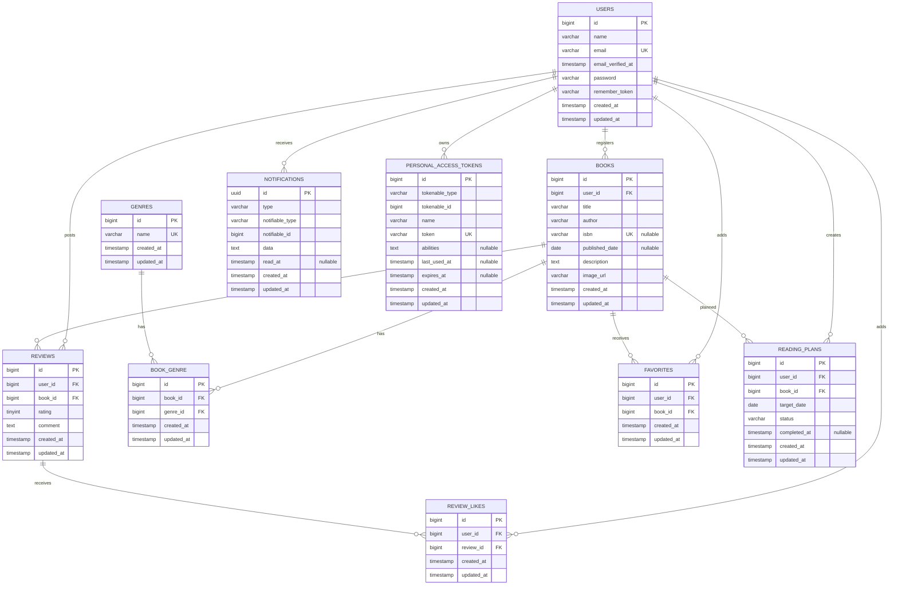

# BookShelf 書籍レビューアプリ

BookShelfは、書籍の登録・閲覧、レビュー、お気に入り、読書計画、リマインダー通知、読書傾向のレポートなどを管理するLaravel製の書籍レビューアプリです。

Webブラウザ向けにはBladeとセッション認証による画面を提供し、外部アプリケーション向けには公開参照APIとLaravel SanctumによるBearerトークン認証付き書籍操作APIを提供します。

## 主な機能

- ユーザー登録・ログイン・ログアウト
- 書籍の一覧・詳細表示・登録・編集・削除
- タイトル・著者のキーワード検索
- ジャンル絞り込み、並び替え、ページネーション
- Google Books APIを利用したISBNによる書籍情報の自動取得
- ジャンルの一覧・詳細表示・登録・編集・削除
- レビューの投稿・編集・削除
- 書籍のお気に入り登録・解除・一覧表示
- レビューへのいいね・解除
- 平均評価・レビュー件数に基づく上位10冊のランキング
- 読書計画の登録・編集・読了・削除・状態別表示
- 期限3日前・当日・3日後のリマインダー通知
- 通知一覧表示と既読処理
- レビュー数・読了冊数・平均評価・評価分布・高評価書籍・ジャンル傾向のレポート
- 検索・ジャンル絞り込み・ページネーション対応のREST API
- Laravel SanctumによるAPIトークン発行・失効
- 書籍、レビュー、読書計画の所有者認可

## 使用技術

- PHP 8.5
- Laravel 10.50.2
- MySQL 8.4
- Laravel Sail
- Laravel Fortify
- Laravel Sanctum
- Google Books API
- Vite 5
- Tailwind CSS 3
- Alpine.js
- PHPUnit 10
- Laravel Pint

## 開発環境URL

| サービス | URL |
|---|---|
| BookShelf | http://localhost |
| phpMyAdmin | http://localhost:8080 |

## 環境構築

### 前提環境

- Git
- Docker DesktopまたはDocker Engine
- Docker Compose

### 1. リポジトリを取得

```bash
git clone https://github.com/07tasuku06-cloud/bookshelf-app.git
cd bookshelf-app
```

### 2. PHP依存パッケージをインストール

ホスト環境にComposerがない場合は、Dockerを使用してインストールします。

```bash
docker run --rm \
  -u "$(id -u):$(id -g)" \
  -v "$(pwd):/var/www/html" \
  -w /var/www/html \
  -e COMPOSER_CACHE_DIR=/tmp/composer_cache \
  laravelsail/php82-composer:latest \
  composer install
```

### 3. 環境変数を設定

```bash
cp .env.example .env
```

`.env`のデータベース設定が次の内容になっていることを確認します。

```env
DB_CONNECTION=mysql
DB_HOST=mysql
DB_PORT=3306
DB_DATABASE=laravel
DB_USERNAME=sail
DB_PASSWORD=password
```

`DB_HOST`には`localhost`ではなく、Docker Composeのサービス名である`mysql`を指定します。

Google Books APIを使用するため、次の環境変数も設定します。

```env
GOOGLE_BOOKS_API_URL=https://www.googleapis.com/books/v1/volumes
GOOGLE_BOOKS_API_KEY=
```

APIキーを使用する場合は、Git管理されない`.env`の`GOOGLE_BOOKS_API_KEY`へ設定してください。空の場合はAPIキーなしでリクエストします。

### 4. Sailを起動

```bash
./vendor/bin/sail up -d
```

### 5. アプリケーションキーを生成

```bash
./vendor/bin/sail artisan key:generate
```

### 6. フロントエンド依存パッケージをインストール

```bash
./vendor/bin/sail npm install
```

### 7. データベースを構築して初期データを投入

```bash
./vendor/bin/sail artisan migrate:fresh --seed
```

`migrate:fresh`は既存のテーブルとデータを削除してから再構築します。既存データを残す必要がある環境では、代わりに次を実行してください。

```bash
./vendor/bin/sail artisan migrate --seed
```

### 8. Vite開発サーバーを起動

```bash
./vendor/bin/sail npm run dev
```

ブラウザで http://localhost を開きます。

開発を終了するときは、Viteを`Ctrl+C`で停止し、次のコマンドでコンテナを停止します。

```bash
./vendor/bin/sail down
```

## 初期データ

| テーブル | 件数 |
|---|---:|
| users | 5 |
| genres | 10 |
| books | 11 |
| reviews | 32 |
| book_genre | 16 |
| favorites | 19 |
| review_likes | 48 |

### テストアカウント

すべての初期ユーザーのパスワードは`password`です。

| 名前 | メールアドレス |
|---|---|
| 山田太郎 | yamada@example.com |
| 鈴木花子 | suzuki@example.com |
| 田中一郎 | tanaka@example.com |
| 佐藤美咲 | sato@example.com |
| 高橋健太 | takahashi@example.com |

## Webの主要URL

| メソッド | パス | 内容 | 認証 |
|---|---|---|---|
| GET | `/` | 書籍一覧（トップ） | 不要 |
| GET | `/books` | 書籍検索・一覧 | 不要 |
| GET | `/books/{book}` | 書籍詳細 | 不要 |
| GET | `/ranking` | 書籍ランキング | 不要 |
| GET / POST | `/register` | 会員登録 | 不要 |
| GET / POST | `/login` | ログイン | 不要 |
| POST | `/logout` | ログアウト | 必要 |
| GET | `/books/create` | 書籍登録画面 | 必要 |
| GET | `/books/isbn/{isbn}` | Google Books APIによるISBN検索 | 必要 |
| GET | `/books/{book}/edit` | 書籍編集画面 | 必要 |
| GET | `/genres` | ジャンル一覧 | 必要 |
| GET | `/favorites` | お気に入り一覧 | 必要 |
| GET | `/reading-plans` | 読書計画一覧 | 必要 |
| GET | `/notifications` | 通知一覧 | 必要 |
| GET | `/reports` | マイ読書レポート | 必要 |

書籍・レビュー・読書計画の更新および削除は、登録者または投稿者本人に限定しています。

## 読書計画リマインダー

読書計画の期限3日前・当日・3日後にデータベース通知を作成します。また、期限を過ぎた未読了の計画を期限超過状態へ更新します。

コマンドを手動実行する場合：

```bash
./vendor/bin/sail artisan reading-plans:process-reminders
```

スケジューラーは`Asia/Tokyo`の毎日9時に実行されます。ローカル環境でスケジューラーを継続実行する場合は、別のターミナルで次を実行します。

```bash
./vendor/bin/sail artisan schedule:work
```

本番環境では、Laravelの`php artisan schedule:run`を毎分実行するCron設定が必要です。

## REST API

ベースURLは`http://localhost/api/v1`です。

書籍一覧・詳細の取得は認証なしで利用できます。書籍の登録・更新・削除には、Laravel Sanctumで発行したBearerトークンが必要です。

### エンドポイント

| メソッド | エンドポイント | 内容 | 認証 | 成功時 |
|---|---|---|---|---:|
| POST | `/api/v1/tokens` | APIトークン発行 | 不要 | 201 |
| DELETE | `/api/v1/tokens/current` | 現在のトークンを失効 | 必要 | 204 |
| GET | `/api/v1/books` | 書籍一覧の取得 | 不要 | 200 |
| GET | `/api/v1/books/{book}` | 書籍詳細の取得 | 不要 | 200 |
| POST | `/api/v1/books` | 書籍の新規登録 | 必要 | 201 |
| PUT / PATCH | `/api/v1/books/{book}` | 書籍の更新 | 必要 | 200 |
| DELETE | `/api/v1/books/{book}` | 書籍の削除 | 必要 | 204 |

### APIトークンの発行

`POST /api/v1/tokens`

```json
{
  "email": "yamada@example.com",
  "password": "password",
  "device_name": "local-development"
}
```

成功時は、次の形式でトークンを返します。

```json
{
  "token": "1|発行されたトークン",
  "token_type": "Bearer"
}
```

認証が必要なAPIでは、HTTPヘッダーへトークンを設定します。

```text
Authorization: Bearer 1|発行されたトークン
Accept: application/json
```

現在使用しているトークンを失効させる場合：

```text
DELETE /api/v1/tokens/current
```

### 書籍一覧

`GET /api/v1/books`

| クエリパラメータ | 型 | 必須 | 内容 |
|---|---|---|---|
| `keyword` | string | 任意 | タイトル・著者・ISBN・説明の部分一致検索。最大255文字 |
| `genre_id` | integer | 任意 | 指定したジャンルIDによる絞り込み |
| `per_page` | integer | 任意 | 1ページの件数。初期値10、1〜100件 |
| `page` | integer | 任意 | 取得するページ番号 |

例：

```text
GET /api/v1/books?keyword=Laravel&genre_id=3&per_page=10&page=1
```

レスポンスの`data`には書籍情報・ジャンル・平均評価・レビュー件数を含みます。`links`と`meta`にはページネーション情報を含みます。

### 書籍詳細

`GET /api/v1/books/{book}`

書籍情報・ジャンル・平均評価・レビュー件数に加え、レビュー投稿者・評価・コメント・投稿日時を返します。

### 書籍登録・更新

`POST /api/v1/books`および`PUT /api/v1/books/{book}`では、JSON形式で次の項目を送信します。

| パラメータ | 型 | 必須 | バリデーション |
|---|---|---|---|
| `title` | string | 必須 | 最大255文字 |
| `author` | string | 必須 | 最大255文字 |
| `isbn` | string | 任意 | 13桁の数字・重複不可 |
| `published_date` | date | 任意 | 有効な日付 |
| `description` | string | 任意 | 書籍の説明 |
| `image_url` | string | 任意 | URL形式・最大2048文字 |
| `genres` | array | 必須 | 存在するジャンルIDを1件以上・重複不可 |

`user_id`はリクエストでは受け取りません。Sanctumで認証されたユーザーのIDを、サーバー側で登録者として設定します。

更新時のISBN重複チェックでは、更新対象の書籍自身を除外します。

リクエスト例：

```json
{
  "title": "Laravel入門",
  "author": "山田太郎",
  "isbn": "9781234567890",
  "published_date": "2026-08-31",
  "description": "Laravelを基礎から学ぶ書籍です。",
  "image_url": "https://example.com/book.jpg",
  "genres": [1, 3]
}
```

### 主なレスポンス項目

```json
{
  "data": {
    "id": 1,
    "user_id": 1,
    "title": "Laravel入門",
    "author": "山田太郎",
    "isbn": "9781234567890",
    "published_date": "2026-08-31",
    "description": "Laravelを基礎から学ぶ書籍です。",
    "image_url": "https://example.com/book.jpg",
    "genres": [],
    "average_rating": 4.5,
    "reviews_count": 2
  }
}
```

### エラーレスポンス

存在しない書籍IDを指定した場合は404を返します。

```json
{
  "message": "指定された書籍は存在しません。"
}
```

入力値がバリデーションを通過しなかった場合は422と日本語のエラーメッセージを返します。

## テスト・コードスタイル

### コードスタイルの確認

```bash
./vendor/bin/sail pint --test
```

### 全自動テスト

```bash
./vendor/bin/sail test
```

### コードカバレッジ

```bash
./vendor/bin/sail test --coverage
```

2026年9月15日時点の結果：

```text
Tests:    135 passed (622 assertions)
Coverage: 95.1%
```

テストでは、次の機能を検証しています。

- Modelのリレーションとキャスト
- Web画面と認証
- 書籍・ジャンル・レビューのCRUD
- 所有者・投稿者に基づく認可
- お気に入りとレビューいいね
- ランキングと高度な書籍検索
- Google Books API連携
- 読書計画とリマインダー
- 通知一覧と既読処理
- マイ読書レポート
- REST API
- SanctumによるBearerトークン認証

## ER図



`notifications`と`personal_access_tokens`はLaravelのPolymorphic Relationshipを使用しています。このアプリでは、どちらもユーザーに紐付けて使用します。

### 複合UNIQUE制約

- `reviews`：`user_id + book_id`
- `book_genre`：`book_id + genre_id`
- `favorites`：`user_id + book_id`
- `review_likes`：`user_id + review_id`

`reading_plans`には`user_id + book_id`の複合UNIQUE制約を設けていないため、同じユーザーが同じ書籍の読書計画を複数回作成できます。

## 基本機能と応用機能

このブランチでは、要件シートに記載されたフェーズ1の基本機能とフェーズ2の応用機能を実装しています。

### 基本機能

- 認証
- 書籍・ジャンル・レビューのCRUD
- お気に入り
- レビューいいね
- ランキング
- REST API
- 自動テスト

### 応用機能

- 高度な書籍検索・フィルタ
- Google Books APIによるISBN検索
- 読書計画
- リマインダー通知と日次バッチ
- 通知一覧と既読処理
- マイ読書レポート
- Laravel SanctumによるAPI認証
- 所有者認可
- PHPDocと型宣言
- 95.1％のテストカバレッジ

## 外部APIの注意事項

Google Books APIの利用上限を超えた場合は、HTTP 429が返されることがあります。

自動テストではLaravel HTTP Clientの`Http::fake()`を使用しているため、外部APIの利用状況に依存せず、正常取得・未検出・通信エラーを検証できます。

## 作成者

- GitHub: https://github.com/07tasuku06-cloud
