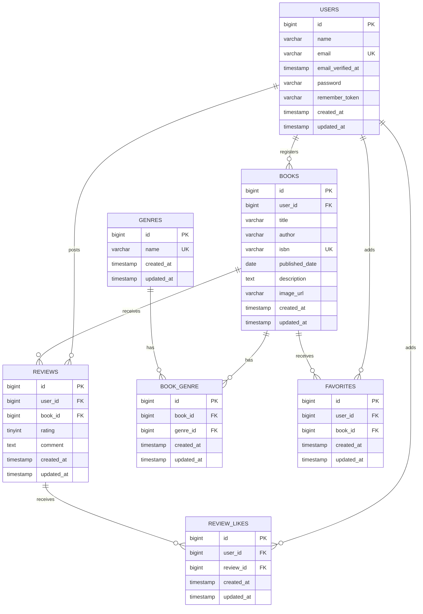

# BookShelf

書籍の登録・レビュー・お気に入り・レビューへのいいねなどを管理する、Laravel製の書籍レビューアプリです。

## 使用技術

- PHP 8.5
- Laravel 10.50.2
- MySQL 8.4
- Laravel Sail
- Vite 5
- Tailwind CSS 3
- Alpine.js

## ER図

### 複合UNIQUE制約

- `reviews`：`user_id + book_id`
- `book_genre`：`book_id + genre_id`
- `favorites`：`user_id + book_id`
- `review_likes`：`user_id + review_id`

## 環境構築

環境構築手順、初期データ、テストアカウントなどは、実装の進行に合わせて追記します。